## Learning Goals
*At the end of this exercise, you will be able to:*    
1. Produce box plots using `ggplot.`  
2. Customize labels on axes using `labs` and `themes`.  
3. Use `color`, `fill`, and `group` to customize plots and improve overall aesthetics.  

## Review
Now that you have been introduced to `ggplot`, let's review the plot types from last week and learn how to manipulate their aesthetics to better suit our needs. Aesthetics make a significant difference, but you can take it too far so remember that the goal is to produce clean plots that are not distracting.  

##Resources
- [ggplot2 cheatsheet](https://www.rstudio.com/wp-content/uploads/2015/03/ggplot2-cheatsheet.pdf)
- [`ggplot` themes](https://ggplot2.tidyverse.org/reference/ggtheme.html)
- [Rebecca Barter `ggplot` Tutorial](http://www.rebeccabarter.com/blog/2017-11-17-ggplot2_tutorial/)

## Load the libraries

```r
library(tidyverse)
library(here)
library(janitor)
```

## Load the data
Let's revisit the mammal life history data to practice our ggplot skills. The [data](http://esapubs.org/archive/ecol/E084/093/) are from: *S. K. Morgan Ernest. 2003. Life history characteristics of placental non-volant mammals. Ecology 84:3402.*

```r
life_history <- read_csv(here("lab10", "data", "mammal_lifehistories_v2.csv")) %>% na_if("-999") %>% clean_names()
```


```r
glimpse(life_history)
```

```
## Rows: 1,440
## Columns: 13
## $ order        <chr> "Artiodactyla", "Artiodactyla", "Artiodactyla", "Artiodac…
## $ family       <chr> "Antilocapridae", "Bovidae", "Bovidae", "Bovidae", "Bovid…
## $ genus        <chr> "Antilocapra", "Addax", "Aepyceros", "Alcelaphus", "Ammod…
## $ species      <chr> "americana", "nasomaculatus", "melampus", "buselaphus", "…
## $ mass         <dbl> 45375.0, 182375.0, 41480.0, 150000.0, 28500.0, 55500.0, 3…
## $ gestation    <dbl> 8.13, 9.39, 6.35, 7.90, 6.80, 5.08, 5.72, 5.50, 8.93, 9.1…
## $ newborn      <dbl> 3246.36, 5480.00, 5093.00, 10166.67, NA, 3810.00, 3910.00…
## $ weaning      <dbl> 3.00, 6.50, 5.63, 6.50, NA, 4.00, 4.04, 2.13, 10.71, 6.60…
## $ wean_mass    <dbl> 8900, NA, 15900, NA, NA, NA, NA, NA, 157500, NA, NA, NA, …
## $ afr          <dbl> 13.53, 27.27, 16.66, 23.02, NA, 14.89, 10.23, 20.13, 29.4…
## $ max_life     <dbl> 142, 308, 213, 240, NA, 251, 228, 255, 300, 324, 300, 314…
## $ litter_size  <dbl> 1.85, 1.00, 1.00, 1.00, 1.00, 1.37, 1.00, 1.00, 1.00, 1.0…
## $ litters_year <dbl> 1.00, 0.99, 0.95, NA, NA, 2.00, NA, 1.89, 1.00, 1.00, 0.7…
```

## Bar Plots
Bar plots count the number of observations in a categorical variable.

```r
life_history %>% 
  count(order, sort=T)
```

```
## # A tibble: 17 × 2
##    order              n
##    <chr>          <int>
##  1 Rodentia         665
##  2 Carnivora        197
##  3 Artiodactyla     161
##  4 Primates         156
##  5 Insectivora       91
##  6 Cetacea           55
##  7 Lagomorpha        42
##  8 Xenarthra         20
##  9 Perissodactyla    15
## 10 Macroscelidea     10
## 11 Pholidota          7
## 12 Scandentia         7
## 13 Sirenia            5
## 14 Hyracoidea         4
## 15 Dermoptera         2
## 16 Proboscidea        2
## 17 Tubulidentata      1
```
count same as group by and summarize

```r
life_history %>% 
  ggplot(aes(x=order)) + geom_bar()+coord_flip()
```

<!-- -->


```r
life_history %>% 
  group_by(order) %>% 
  summarize(mean_mass=mean(mass, na.rm=T))
```

```
## # A tibble: 17 × 2
##    order          mean_mass
##    <chr>              <dbl>
##  1 Artiodactyla     115843.
##  2 Carnivora         43382.
##  3 Cetacea         9830457.
##  4 Dermoptera         1000 
##  5 Hyracoidea         3031.
##  6 Insectivora         133.
##  7 Lagomorpha         1702.
##  8 Macroscelidea       124.
##  9 Perissodactyla   694487.
## 10 Pholidota          7980 
## 11 Primates           5145.
## 12 Proboscidea     3342500 
## 13 Rodentia            637.
## 14 Scandentia          389.
## 15 Sirenia         1169400 
## 16 Tubulidentata     60000 
## 17 Xenarthra          7238.
```
Wants to put everything in scientific notation 

```r
options(scipen=999) #cancels scientific notation for the session
```


```r
life_history %>% 
  group_by(order) %>% 
  summarize(mean_mass=mean(mass, na.rm=T)) %>% 
  ggplot(aes(x=order, y=mean_mass))+geom_col()
```

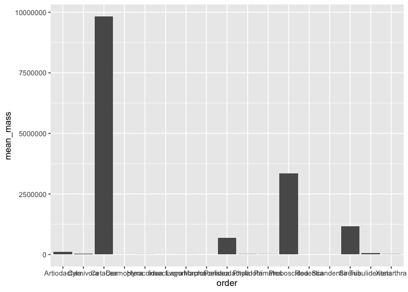<!-- -->


```r
life_history %>% 
  group_by(order) %>% 
  summarize(mean_mass=mean(mass, na.rm=T)) %>% 
  ggplot(aes(x=reorder(order,mean_mass),y=mean_mass))+geom_col()+coord_flip()+scale_y_log10()
```

<!-- -->
Scale to log scale 
## Scatterplots
Scatter plots allow for comparisons of two continuous variables.

```r
life_history %>% 
  ggplot(aes(x=gestation, y=wean_mass)) + geom_point(na.rm=T) + scale_y_log10() + geom_smooth(method="lm")
```

```
## `geom_smooth()` using formula 'y ~ x'
```

```
## Warning: Removed 1066 rows containing non-finite values (stat_smooth).
```

<!-- -->

## Boxplots
Box plots help us visualize a range of values. So, on the x-axis we typically have something categorical and the y-axis is the range.

```r
glimpse(life_history)
```

```
## Rows: 1,440
## Columns: 13
## $ order        <chr> "Artiodactyla", "Artiodactyla", "Artiodactyla", "Artiodac…
## $ family       <chr> "Antilocapridae", "Bovidae", "Bovidae", "Bovidae", "Bovid…
## $ genus        <chr> "Antilocapra", "Addax", "Aepyceros", "Alcelaphus", "Ammod…
## $ species      <chr> "americana", "nasomaculatus", "melampus", "buselaphus", "…
## $ mass         <dbl> 45375.0, 182375.0, 41480.0, 150000.0, 28500.0, 55500.0, 3…
## $ gestation    <dbl> 8.13, 9.39, 6.35, 7.90, 6.80, 5.08, 5.72, 5.50, 8.93, 9.1…
## $ newborn      <dbl> 3246.36, 5480.00, 5093.00, 10166.67, NA, 3810.00, 3910.00…
## $ weaning      <dbl> 3.00, 6.50, 5.63, 6.50, NA, 4.00, 4.04, 2.13, 10.71, 6.60…
## $ wean_mass    <dbl> 8900, NA, 15900, NA, NA, NA, NA, NA, 157500, NA, NA, NA, …
## $ afr          <dbl> 13.53, 27.27, 16.66, 23.02, NA, 14.89, 10.23, 20.13, 29.4…
## $ max_life     <dbl> 142, 308, 213, 240, NA, 251, 228, 255, 300, 324, 300, 314…
## $ litter_size  <dbl> 1.85, 1.00, 1.00, 1.00, 1.00, 1.37, 1.00, 1.00, 1.00, 1.0…
## $ litters_year <dbl> 1.00, 0.99, 0.95, NA, NA, 2.00, NA, 1.89, 1.00, 1.00, 0.7…
```


```r
life_history %>% 
  ggplot(aes(x=order, y=mass))+geom_boxplot()+scale_y_log10()+coord_flip()
```

```
## Warning: Removed 85 rows containing non-finite values (stat_boxplot).
```

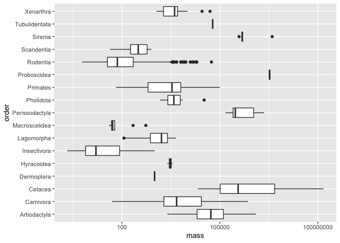<!-- -->

Remember, you can always use dplyr functions to focus your question, summarize, etc.

```r
life_history %>% 
  filter(order=="Primates") %>% 
  ggplot(aes(x=family, y=mass))+geom_boxplot(na.rm=T)+scale_y_log10()+coord_flip()
```

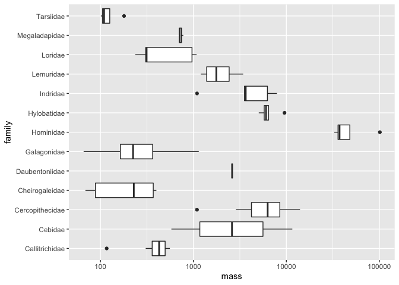<!-- -->

## Practice  
For this practice, let's go back to the elephants data from midterm 1. Maybe we can make our midterm answers "pop" with some nice plots!

```r
elephants <- read_csv(here("lab10", "data", "ElephantsMF.csv")) %>% clean_names()
```

```
## Rows: 288 Columns: 3
## ── Column specification ────────────────────────────────────────────────────────
## Delimiter: ","
## chr (1): Sex
## dbl (2): Age, Height
## 
## ℹ Use `spec()` to retrieve the full column specification for this data.
## ℹ Specify the column types or set `show_col_types = FALSE` to quiet this message.
```

1. On midterm 1, I asked how many male and female elephants were represented in the data. How would you make a plot of this?

```r
elephants %>% 
  ggplot(aes(x=sex)) + geom_bar()
```

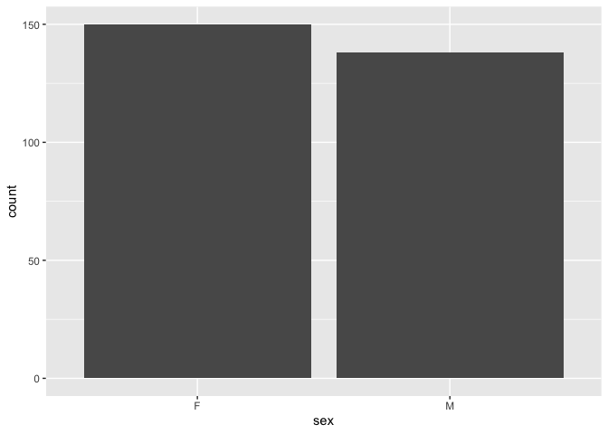<!-- -->

2. How does the age of elephants compare by sex?

```r
elephants %>% 
  group_by(sex) %>% 
  summarize(mean_age=mean(age, na.rm=T)) %>% 
  ggplot(aes(x=sex,y=mean_age))+geom_col()
```

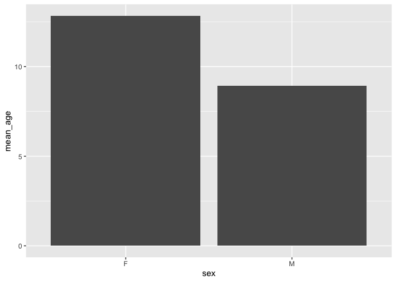<!-- -->

make box-plot 
3. What is the relationship between age and height?

```r
elephants %>% 
  ggplot(aes(x=age, y=height)) + geom_point(na.rm=T) + geom_smooth(method="lm")
```

```
## `geom_smooth()` using formula 'y ~ x'
```

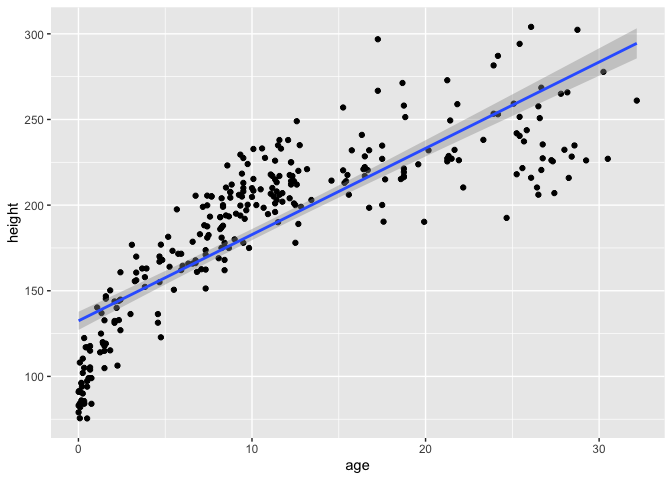<!-- -->
Positive relationship 
## Aesthetics: Labels
Now that we have practiced scatter plots, bar plots, and box plots we need to learn how to adjust their appearance to suit our needs. Let's start with labeling x and y axes.  

In the example above we looked at age and height of elephants.

```r
elephants %>% 
  ggplot(aes(x=age, y=height)) + geom_point() + geom_smooth(method=lm, se=F)
```

```
## `geom_smooth()` using formula 'y ~ x'
```

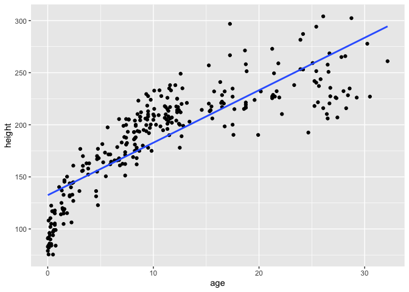<!-- -->

The plot looks clean, but it is incomplete. A reader unfamiliar with the data might have a difficult time interpreting the labels. To add custom labels, we use the `labs` command.

```r
elephants %>% 
  ggplot(aes(x=age, y=height)) + geom_point() + geom_smooth(method=lm, se=F)+
  labs(title="Elephant Age vs. Height",
       x="Age",
       y="Height (cm)")
```

```
## `geom_smooth()` using formula 'y ~ x'
```

<!-- -->

We can improve the plot further by adjusting the size and face of the text. We do this using `theme()`.

```r
elephants %>% 
  ggplot(aes(x=age, y=height)) + geom_point() + geom_smooth(method=lm, se=F) +
  labs(title = "Elephant Age vs. Height",
       x = "Age",
       y = "Height") +
  theme(plot.title = element_text(size = 12, face = "bold"),
        axis.text = element_text(size = 10),
        axis.title = element_text(size = 10))
```

```
## `geom_smooth()` using formula 'y ~ x'
```

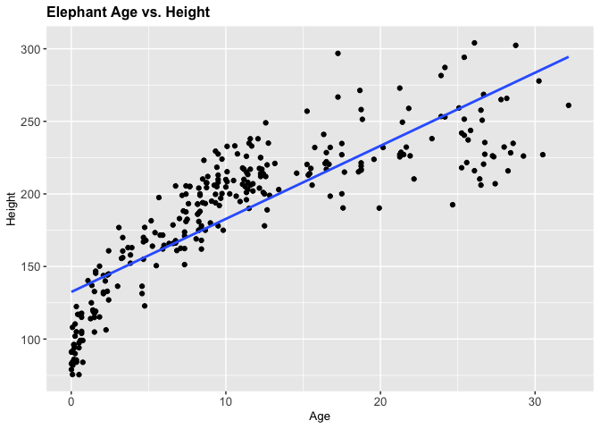<!-- -->

The `rel()` option changes the relative size of the title to keep things consistent. Adding `hjust` allows control of title position.

```r
elephants %>% 
  ggplot(aes(x=age, y=height)) + geom_point() + geom_smooth(method=lm, se=F) +
  labs(title = "Elephant Age vs. Height",
       x = "Age",
       y = "Height") +
  theme(plot.title = element_text(size = rel(1.5), hjust = 0.5))
```

```
## `geom_smooth()` using formula 'y ~ x'
```

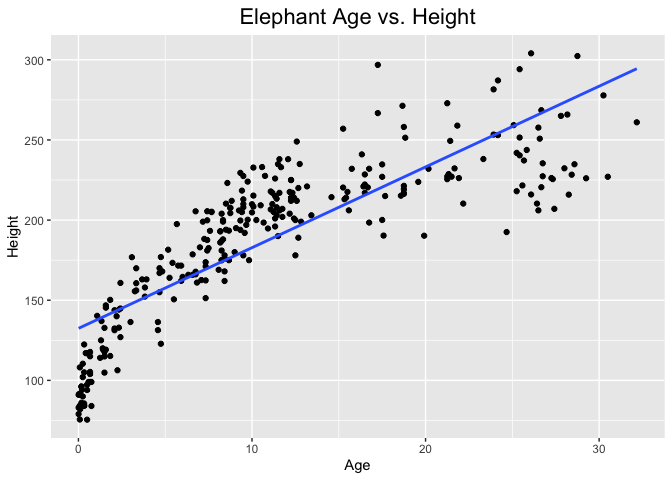<!-- -->
rel-relative size; title and x and y scaled relative to each other
## Other Aesthetics
There are lots of options for aesthetics. An aesthetic can be assigned to either numeric or categorical data. `fill` is a common grouping option; notice that an appropriate key is displayed when you use one of these options.

```r
elephants %>% 
  ggplot(aes(x=sex, fill=sex))+geom_bar()+
  labs(title = "# Elephants by Sex",
       x = "Sex",
       y = NULL) +
  theme(plot.title = element_text(size = rel(1.5), hjust = 0.5))
```

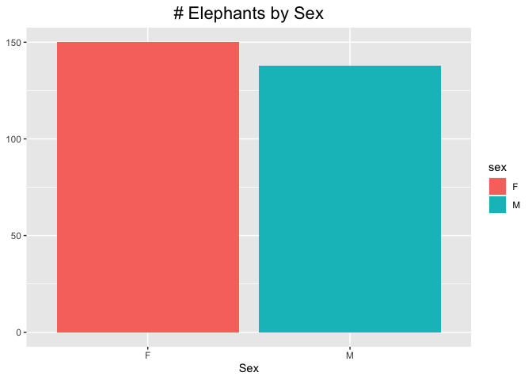<!-- -->
fill- add color by variable 
`size` adjusts the size of points relative to a continuous variable.

```r
life_history %>% 
  ggplot(aes(x=gestation, y=log10(mass), size=mass))+
  geom_point(na.rm=T)
```

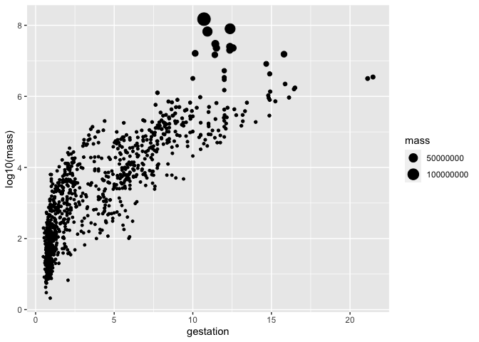<!-- -->
Scaled size by the mass

```r
life_history %>% 
  filter(gestation>20)
```

```
## # A tibble: 2 × 13
##   order    family genus species   mass gestation newborn weaning wean_mass   afr
##   <chr>    <chr>  <chr> <chr>    <dbl>     <dbl>   <dbl>   <dbl>     <dbl> <dbl>
## 1 Probosc… Eleph… Elep… maximus 3.18e6      21.1 100039.    18          NA  127.
## 2 Probosc… Eleph… Loxo… africa… 3.51e6      21.5  99006.    39.4    600000  148.
## # … with 3 more variables: max_life <dbl>, litter_size <dbl>,
## #   litters_year <dbl>
```

## Practice
Let's end today's lab by looking at the homerange data. By now, these should be very familiar to you.

```r
homerange <- read_csv(here("lab10", "data", "Tamburelloetal_HomeRangeDatabase.csv"))
```

```
## Rows: 569 Columns: 24
## ── Column specification ────────────────────────────────────────────────────────
## Delimiter: ","
## chr (16): taxon, common.name, class, order, family, genus, species, primarym...
## dbl  (8): mean.mass.g, log10.mass, mean.hra.m2, log10.hra, dimension, preyma...
## 
## ℹ Use `spec()` to retrieve the full column specification for this data.
## ℹ Specify the column types or set `show_col_types = FALSE` to quiet this message.
```


```r
names(homerange)
```

```
##  [1] "taxon"                      "common.name"               
##  [3] "class"                      "order"                     
##  [5] "family"                     "genus"                     
##  [7] "species"                    "primarymethod"             
##  [9] "N"                          "mean.mass.g"               
## [11] "log10.mass"                 "alternative.mass.reference"
## [13] "mean.hra.m2"                "log10.hra"                 
## [15] "hra.reference"              "realm"                     
## [17] "thermoregulation"           "locomotion"                
## [19] "trophic.guild"              "dimension"                 
## [21] "preymass"                   "log10.preymass"            
## [23] "PPMR"                       "prey.size.reference"
```

1. Make a barplot that shows counts of ectotherms and endotherms. Label the axes, provide a title, and fill by `thermoregulation`.

```r
homerange %>% 
  ggplot(aes(x=thermoregulation, fill=thermoregulation))+geom_bar()+
  labs(title="Count of Ectotherms vs. Endotherms",
       x="Thermoregulation Type",
       y="Count") 
```

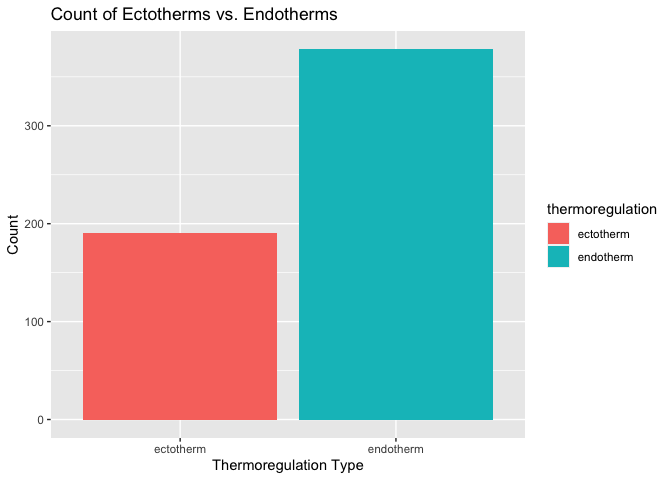<!-- -->

2. Make a scatterplot that compares log10.mass and homerange. Adjust the size of points by mass. Label the axes and provide a title.


## That's it! Take a break and I will see you on Zoom!  

-->[Home](https://jmledford3115.github.io/datascibiol/)
