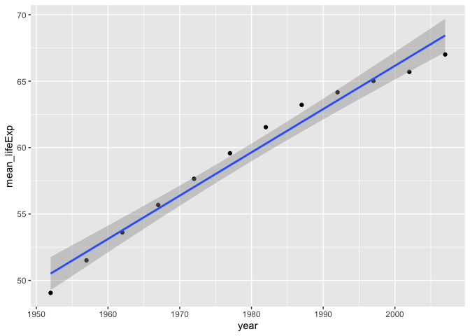
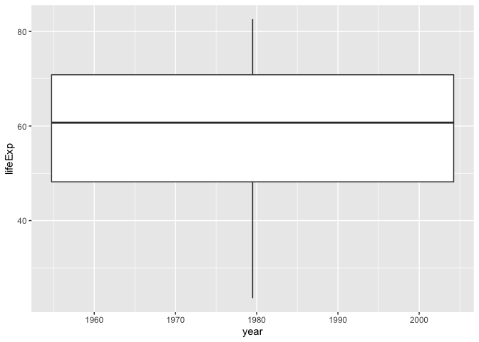
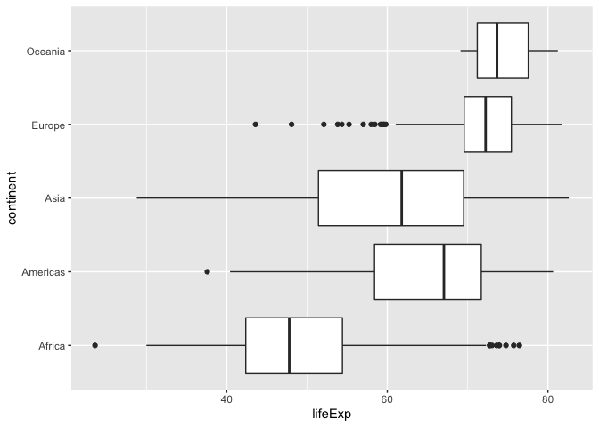
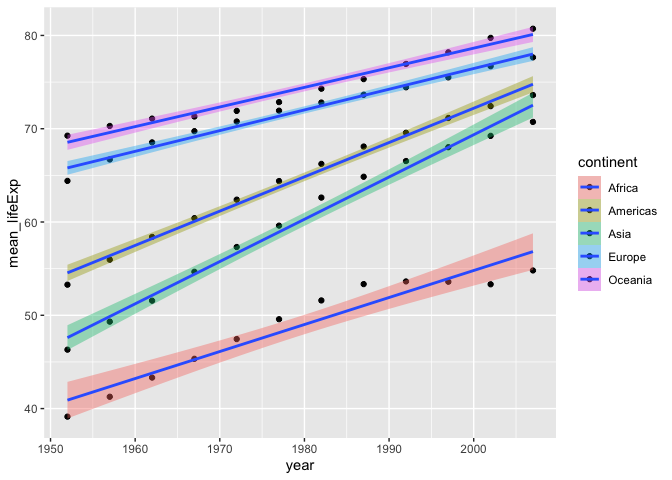
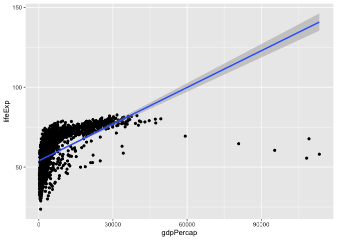
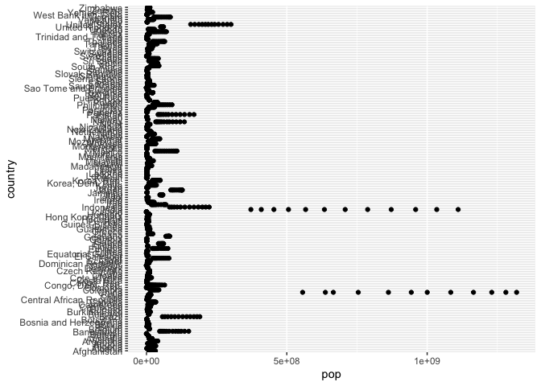
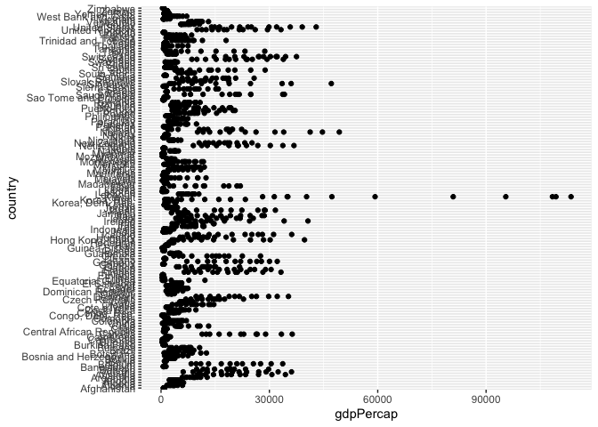

## Instructions
Answer the following questions and complete the exercises in RMarkdown. Please embed all of your code and push your final work to your repository. Your final lab report should be organized, clean, and run free from errors. Remember, you must remove the `#` for the included code chunks to run. Be sure to add your name to the author header above. For any included plots, make sure they are clearly labeled. You are free to use any plot type that you feel best communicates the results of your analysis.  

**In this homework, you should make use of the aesthetics you have learned. It's OK to be flashy!**

Make sure to use the formatting conventions of RMarkdown to make your report neat and clean!  

## Load the libraries

```r
library(tidyverse)
library(janitor)
library(here)
library(naniar)
```

## Resources
The idea for this assignment came from [Rebecca Barter's](http://www.rebeccabarter.com/blog/2017-11-17-ggplot2_tutorial/) ggplot tutorial so if you get stuck this is a good place to have a look.  

## Gapminder
For this assignment, we are going to use the dataset [gapminder](https://cran.r-project.org/web/packages/gapminder/index.html). Gapminder includes information about economics, population, and life expectancy from countries all over the world. You will need to install it before use. This is the same data that we will use for midterm 2 so this is good practice.

```r
#install.packages("gapminder")
library("gapminder")
```

## Questions
The questions below are open-ended and have many possible solutions. Your approach should, where appropriate, include numerical summaries and visuals. Be creative; assume you are building an analysis that you would ultimately present to an audience of stakeholders. Feel free to try out different `geoms` if they more clearly present your results.  

**1. Use the function(s) of your choice to get an idea of the overall structure of the data frame, including its dimensions, column names, variable classes, etc. As part of this, determine how NA's are treated in the data.**  

```r
glimpse(gapminder)
```

```
## Rows: 1,704
## Columns: 6
## $ country   <fct> "Afghanistan", "Afghanistan", "Afghanistan", "Afghanistan", …
## $ continent <fct> Asia, Asia, Asia, Asia, Asia, Asia, Asia, Asia, Asia, Asia, …
## $ year      <int> 1952, 1957, 1962, 1967, 1972, 1977, 1982, 1987, 1992, 1997, …
## $ lifeExp   <dbl> 28.801, 30.332, 31.997, 34.020, 36.088, 38.438, 39.854, 40.8…
## $ pop       <int> 8425333, 9240934, 10267083, 11537966, 13079460, 14880372, 12…
## $ gdpPercap <dbl> 779.4453, 820.8530, 853.1007, 836.1971, 739.9811, 786.1134, …
```

**2. Among the interesting variables in gapminder is life expectancy. How has global life expectancy changed between 1952 and 2007?**

```r
gapminder %>% 
  group_by(year) %>% 
  summarize(mean_lifeExp=mean(lifeExp)) %>% 
  ggplot(aes(x=year, y=mean_lifeExp)) + geom_point(na.rm=T) + geom_smooth(method="lm") 
```

```
## `geom_smooth()` using formula 'y ~ x'
```

<!-- -->
Overall life expectancy increased 
**3. How do the distributions of life expectancy compare for the years 1952 and 2007?**

```r
gapminder %>% 
  ggplot(aes(x=year, y=lifeExp)) +
  geom_boxplot()
```

```
## Warning: Continuous x aesthetic -- did you forget aes(group=...)?
```

<!-- -->

```r
gapminder %>% 
  summarize(mean_lifeExp=mean(lifeExp),
            min_lifeExp=min(lifeExp),
            max_lifeExp=max(lifeExp))
```

```
## # A tibble: 1 × 3
##   mean_lifeExp min_lifeExp max_lifeExp
##          <dbl>       <dbl>       <dbl>
## 1         59.5        23.6        82.6
```
**4. Your answer above doesn't tell the whole story since life expectancy varies by region. Make a summary that shows the min, mean, and max life expectancy by continent for all years represented in the data.**

```r
gapminder %>% 
  group_by(continent) %>% 
  ggplot(aes(x=continent, y=lifeExp)) +
  geom_boxplot() + coord_flip()
```

<!-- -->

**5. How has life expectancy changed between 1952-2007 for each continent?**

```r
gapminder %>% 
  group_by(year, continent) %>% 
  summarize(mean_lifeExp=mean(lifeExp)) %>% 
  ggplot(aes(x=year, y=mean_lifeExp, fill= continent)) + geom_point(na.rm=T) + geom_smooth(method="lm") 
```

```
## `summarise()` has grouped output by 'year'. You can override using the
## `.groups` argument.
## `geom_smooth()` using formula 'y ~ x'
```

<!-- -->

**6. We are interested in the relationship between per capita GDP and life expectancy; i.e. does having more money help you live longer?**

```r
gapminder %>% 
  ggplot(aes(x=gdpPercap, y=lifeExp)) + geom_point(na.rm=T) + geom_smooth(method="lm") 
```

```
## `geom_smooth()` using formula 'y ~ x'
```

<!-- -->
Positive relation- yes having more morey does help you live longer 
**7. Which countries have had the largest population growth since 1952?**

```r
gapminder %>% 
  pivot_wider(names_from = "year",
              names_prefix = "p",
              values_from = "pop") %>% 
  mutate(difference=p1952- p2007, na.rm=T) %>% 
  arrange(difference)
```

```
## # A tibble: 1,704 × 18
##    country   continent lifeExp gdpPercap   p1952   p1957   p1962   p1967   p1972
##    <fct>     <fct>       <dbl>     <dbl>   <int>   <int>   <int>   <int>   <int>
##  1 Afghanis… Asia         28.8      779. 8425333      NA NA      NA      NA     
##  2 Afghanis… Asia         30.3      821.      NA 9240934 NA      NA      NA     
##  3 Afghanis… Asia         32.0      853.      NA      NA  1.03e7 NA      NA     
##  4 Afghanis… Asia         34.0      836.      NA      NA NA       1.15e7 NA     
##  5 Afghanis… Asia         36.1      740.      NA      NA NA      NA       1.31e7
##  6 Afghanis… Asia         38.4      786.      NA      NA NA      NA      NA     
##  7 Afghanis… Asia         39.9      978.      NA      NA NA      NA      NA     
##  8 Afghanis… Asia         40.8      852.      NA      NA NA      NA      NA     
##  9 Afghanis… Asia         41.7      649.      NA      NA NA      NA      NA     
## 10 Afghanis… Asia         41.8      635.      NA      NA NA      NA      NA     
## # … with 1,694 more rows, and 9 more variables: p1977 <int>, p1982 <int>,
## #   p1987 <int>, p1992 <int>, p1997 <int>, p2002 <int>, p2007 <int>,
## #   difference <int>, na.rm <lgl>
```


```r
gapminder %>% 
  group_by(country) %>% 
  filter(year == "1952" | year == "2007" )
```

```
## # A tibble: 284 × 6
## # Groups:   country [142]
##    country     continent  year lifeExp      pop gdpPercap
##    <fct>       <fct>     <int>   <dbl>    <int>     <dbl>
##  1 Afghanistan Asia       1952    28.8  8425333      779.
##  2 Afghanistan Asia       2007    43.8 31889923      975.
##  3 Albania     Europe     1952    55.2  1282697     1601.
##  4 Albania     Europe     2007    76.4  3600523     5937.
##  5 Algeria     Africa     1952    43.1  9279525     2449.
##  6 Algeria     Africa     2007    72.3 33333216     6223.
##  7 Angola      Africa     1952    30.0  4232095     3521.
##  8 Angola      Africa     2007    42.7 12420476     4797.
##  9 Argentina   Americas   1952    62.5 17876956     5911.
## 10 Argentina   Americas   2007    75.3 40301927    12779.
## # … with 274 more rows
```

**8. Use your results from the question above to plot population growth for the top five countries since 1952.**

```r
gapminder %>% 
   ggplot(aes(x=country, y=pop)) + geom_point(na.rm=T)+coord_flip()
```

<!-- -->

**9. How does per-capita GDP growth compare between these same five countries?**

```r
gapminder %>% 
   ggplot(aes(x=country, y=gdpPercap)) + geom_point(na.rm=T)+coord_flip()
```

<!-- -->

**10. Make one plot of your choice that uses faceting!**

## Push your final code to GitHub!
Please be sure that you check the `keep md` file in the knit preferences. 
